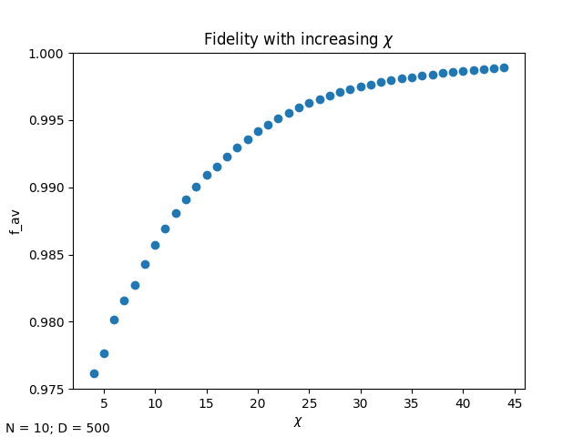
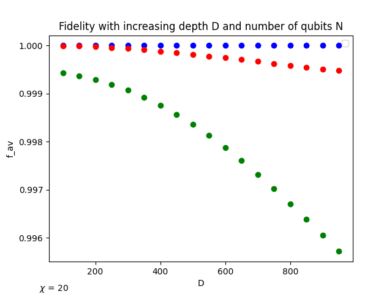
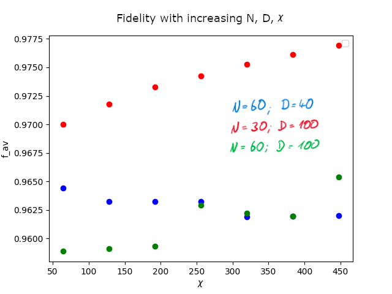

# Results 

This folder contains some results that have been computed by the algorithm. The scrit-files that have been used for this results are located in the projects root folder.

## Increasing maximum number of bond dimensions	&#967;

As expected, the 2-qubit fidelity becomes more exact, once we increase the max-bond-dimension size. If we increase it exponentially large, the fidelity will become 1.

## Increase number of qubits N and depth D

If we increase both the number of qubits and the depth of the circuit, the fidelity decreases. 

It is stated in the paper, that the fidelity converges at a static value. With my results, I can not underline these assumptions.
But the reason for this could be that there is no orthonomalization at each 2-qubit gate. This would lower the error rate.

## Increase N, D and &#967;

In order to recreate the results of the paper, I calculated the fidelity with increasing D, N and number of bond dimensions &#967;, like they did in the paper. They came to the result, that the fidelity converges at a fixed value at about 99%.

However, my calculation below does not converge. The curves with increased N and D (green and blue) are also not well shaped like the red one. (This "weird" shape could be because of approximation on my machine).

But like in the paper the curves with increased D and N get closer toghether, which is a sign, thath the fidelity will converge. My calculations for high D and N result in a fidelity of the order of 96%, which is less than in the paper, but is again because of the missing orthonormalization in my simulation.

## Conclusion

Like in the paper assumed, this simulation of a quantum computer is based on a MPS representation of the quantum state and approximates the state after each 2-particle gate to scale linear with D and N. 

I was not able to recalculate the exact results of the paper authors regarding the converging of the fidelity at a fixed value of 99%. This can be due to the missing orthonormalization in my simulation.

Still the average fidelity of all my calculations have been of the order of 96%, which still can compete with real quantum computers.